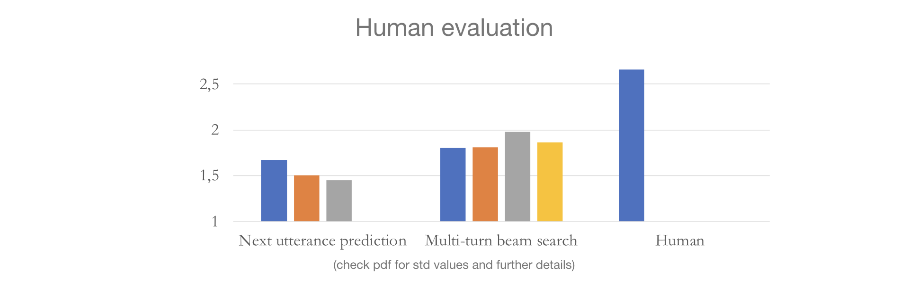

# Multi-Turn Beam Search for Neural Dialogue Modeling

https://arxiv.org/abs/1906.00141

## Abstract

In neural dialogue modeling, a neural network is trained to predict the next utterance, and at inference time, an approximate decoding algorithm is used to generate next utterances given previous ones. While this autoregressive framework allows us to model the whole conversation during training, inference is highly suboptimal, as a wrong utterance can affect future utterances. While beam search yields better results than greedy search does, we argue that it is still greedy in the context of the entire conversation, in that it does not consider future utterances. We propose a novel approach for conversation-level inference by explicitly modeling the dialogue partner and running beam search across multiple conversation turns. Given a set of candidates for next utterance, we unroll the conversation for a number of turns and identify the candidate utterance in the initial hypothesis set that gives rise to the most likely sequence of future utterances. We empirically validate our approach by conducting human evaluation using the Persona-Chat dataset, and find that our multi-turn beam search generates significantly better dialogue responses. We propose three approximations to the partner model, and observe that more informed partner models give better performance.

## Citation

>@misc{kulikov2019multiturn,
> 		title={Multi-Turn Beam Search for Neural Dialogue Modeling},
>    		author={Ilia Kulikov and Jason Lee and Kyunghyun Cho},
>    		year={2019},
>    		eprint={1906.00141},
>    		archivePrefix={arXiv},
>    		primaryClass={cs.CL}
>	}
